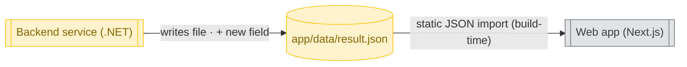

Your task is to turn a slice's spec into a reviewable architecture artifact and write it as the `architecture` sticky comment on the issue. The artifact describes the **public API changes between the components** the work touches, plus a component diagram — it is reviewed by a colleague (human or AI) before implementation, so it must be unambiguous and complete.

This skill sits between `/spec` (the *what*) and `/implement` (the *how* inside each component). Your job is the seam in between: the component boundaries and the public contracts that cross them. You stay at the boundary — what happens *inside* a component is an implementation detail and belongs to the implementation plan, not here.

YOU DO NOT IMPLEMENT THE USER'S REQUEST. Only write the `architecture` sticky comment to the GitHub issue.

## Step 1 — Identify the slice issue

Scan the user's request for a GitHub issue reference (a full GitHub issue URL, or a `#NNN` token). If none is present, stop and ask the user which issue this is for. Do not proceed without an explicit issue reference.

Once you have an issue number, fetch it:

```bash
gh issue view <number-or-url> --json number,title,body,url
```

Record the issue number and URL for use in Step 4.

## Step 2 — Read the spec and learn the codebase context

Read the slice's spec from the `spec` sticky comment:

```bash
~/.claude/scripts/gh-sticky get-body <number> spec
```

If the `spec` sticky does not exist, warn the user that no spec has been written for this issue and that running `/spec` first is strongly recommended. Then fall back to the raw issue body (from Step 1) as your statement of intent and continue — but treat the gap as a risk and flag any ambiguity it creates during the interview.

Before designing anything, read the following to understand how the slice fits the existing system and, critically, **where the existing component boundaries are** — the diagram must reflect reality:

- The root `CLAUDE.md` — use it as an index. It should point to any steering docs (architecture, component docs, coding guidelines) relevant to this area. Read whichever apply, especially architecture/component docs.
- The source of the components the slice touches — enough to know each component's current public surface (what it already exposes to its neighbours).
- Query the slice's parent epic with the `gh-sticky` helper (run with no args for usage — use it for all sticky-comment and issue-tree access, never chain `gh api` calls inline):

```bash
~/.claude/scripts/gh-sticky parent <number>
```

This prints the `parent { … subIssues … }` JSON, or `null`. If a parent exists, read its body — the architecture must sit consistently within the epic's goals and any boundaries it has already established.

When reasoning about boundaries and which dependencies cross them, use the deep-vs-shallow-module and ports-&-adapters vocabulary from `~/.claude/skills/improve-codebase-architecture/REFERENCE.md` (in-process, local-substitutable, remote-but-owned, true-external). A good boundary is a small interface hiding a large implementation.

## Step 3 — Grill the user on the component boundaries and public APIs

Interview the user relentlessly about the architecture of this slice until you reach a shared understanding. Walk down each branch of the decision tree, resolving dependencies between decisions one-by-one. Follow each branch where it leads — if defining one component's contract surfaces a question about another's, chase it down then rather than deferring it to a later "round".

**How to ask:**

- Ask questions **one at a time** — never bundle multiple questions into a single turn. Wait for the answer before moving on.
- For each question, **provide your recommended answer** along with the question, so the user can react to a concrete proposal rather than a blank slate. Explain briefly why you recommend it.
- If a question can be answered by **exploring the codebase**, explore it instead of asking the user. Only ask when the answer genuinely requires the user's intent or knowledge.
- After each answer, if a decision is now settled, fold it into the relevant section of the artifact straight away rather than batching at the end.

**Areas to make sure you cover.** This is not a script to read through in order — it's a checklist of categories the artifact must address before you can exit this step. Use it to notice gaps the decision-tree walk would otherwise miss.

- **Components in play** — which existing **structural units** the work touches: projects, executables/services, on-disk files & datastores, and external/third-party systems. These — *not* classes, functions, types, hooks, or UI elements — are the nodes of the component diagram. Establish whether any *new* unit is introduced, whether responsibilities move between units, and classify each as new / modified / untouched-but-relevant before pinning down the edges. The class/type/file-field detail that lives *inside* a unit belongs in *Public API Changes*, never as a diagram node.
- **Transports between units** — for each edge: the mechanism that carries the contract across the boundary (e.g. `HTTP POST /releases`, `static JSON import (build-time)`, `message/event`, `DB query`, `in-process call`) and what crosses it. Every edge in the diagram is a transport and must be labelled with one.
- **Public API surface between components** — for each edge in the diagram: the new or changed contract (method/endpoint/event/message signature) that one component exposes to another, including its inputs, outputs, and error shape. The names of the types that cross the boundary are in scope; the internal classes and functions that produce them are not.
- **Contract edge cases** — versioning and backward compatibility of any changed contract; how failures are represented across the boundary; whether each contract is synchronous or asynchronous. Stay at the boundary — do not specify how a component handles these internally.

For each item the slice touches, confirm the boundary behaviour — do not leave it as "TBD". If something genuinely doesn't apply (e.g. no new contract is introduced because the change is internal to one component), note that and move on.

**Scope and deferral sweep.** When you believe you're done, review every answer and ask yourself: are there remaining ambiguities, implicit assumptions, or "it depends" answers about the boundaries that have not been pinned down? If yes, ask those questions now (one at a time, with a recommended answer). Repeat the sweep until the answer is no.

Do not proceed to Step 4 until you can answer "yes" to all of the following:

- Every component the work touches is identified and classified as new, modified, or untouched-but-relevant.
- Every public API change between components has a defined contract (signature, inputs, outputs, error shape).
- The "Open Questions" section will either be empty or contain only items the user has deliberately chosen to leave unresolved.

## Step 4 — Write the architecture as a sticky comment

Render the artifact using the template below to `/tmp/architecture-body.md` — just the body, no marker (the helper adds it). Then create or update the `architecture` sticky comment:

```bash
~/.claude/scripts/gh-sticky upsert <number> architecture /tmp/architecture-body.md
```

Always pass the body via the temp file — never construct comment text inline. Capture the issue URL for Step 5.

### Architecture body template

````markdown
# Architecture

_Generated by Claude Code._

## Overview

[One or two sentences: which components this work spans and the gist of the public API changes.]

## Component Diagram

A **structural** view: every node is a deployable/structural unit, every edge is a transport.

- **Nodes** are projects, executables/services, on-disk files & datastores, or external/third-party systems — *never* classes, functions, types, hooks, or individual UI elements. Use `[[Name]]` for an executable / project / service and `[(path/name)]` for an on-disk file or datastore. Show one node per real artefact (e.g. one node per result file actually changed), not a collapsed abstraction.
- **Edges** are transports: label each with the mechanism, and where useful what crosses it — e.g. `HTTP POST /releases`, `static JSON import (build-time)`, `message/event`, `DB query`, `in-process call`. An unlabelled edge is a smell; name the transport.
- **Colour** marks new / modified / untouched via the classDefs below. Mark every node.

Keep the diagram to the units this slice actually touches plus their immediate untouched neighbours. If it grows past ~6–8 nodes, you have probably dropped below the component boundary — pull that detail up into *Public API Changes* prose. The example below is the whole structure for a backend→file→frontend slice; that is the altitude to aim for.



## Public API Changes

[For each component boundary that changes: the component, and the contract it
exposes to its neighbours (method / endpoint / event / message signature), with
inputs, outputs, and error shape. Group by component. Boundary contracts only.]

## Out of Scope (architecture)

[Boundaries and contracts that are explicitly NOT changing, to prevent reviewers
from making different assumptions about scope.]

## Open Questions

[Any unresolved ambiguities the user has explicitly chosen to defer — not items
that were never asked. If you reached Step 4, this should be empty or contain
only deliberate deferrals. Do not write the artifact if you still have unanswered
questions; go back to Step 3.]
````

### Rules for the artifact content

- Describe the contracts **between** components, never the logic **inside** them.
- A component's internal class names, function signatures, algorithms, and data structures are out of bounds — those belong in the implementation plan (`slice-planner`'s job).
- **Diagram nodes are structural units only** — projects, executables/services, on-disk files & datastores, external systems. Classes, types, hooks, and UI elements are *not* nodes; if they matter, name them in the *Public API Changes* prose. The contract-field detail (which new field, which type) goes in prose and at most as a short edge label — never as its own node.
- **Every diagram edge is a transport** and must be labelled with its mechanism (HTTP, static file import, message/event, DB query, in-process call, …).
- Mark every node in the diagram as new, modified, or untouched.
- Never add anything the user didn't agree to during the interview.
- Default to the smallest set of boundary changes that satisfies the spec.

## Step 5 — Hand off

Tell the user the issue URL and that the architecture is ready for them to review, and then for implementation with `/implement` (which will treat these public API contracts as fixed). Do not commit, branch, or open a PR — the existing `/pr` skill handles that once code changes exist. Do not close the issue — it stays open until the implementing PR merges.
